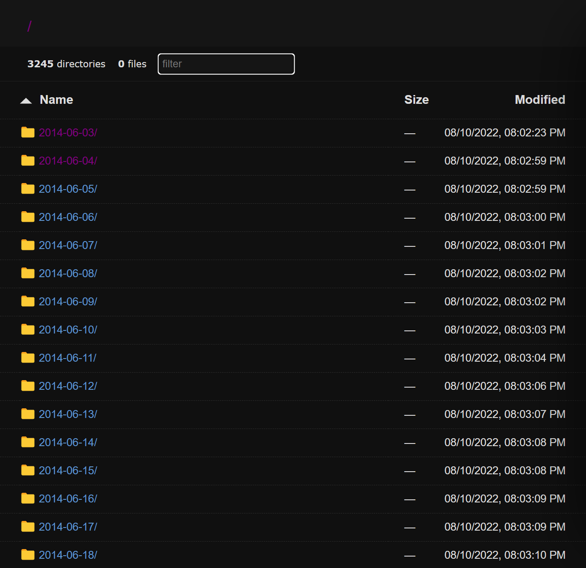
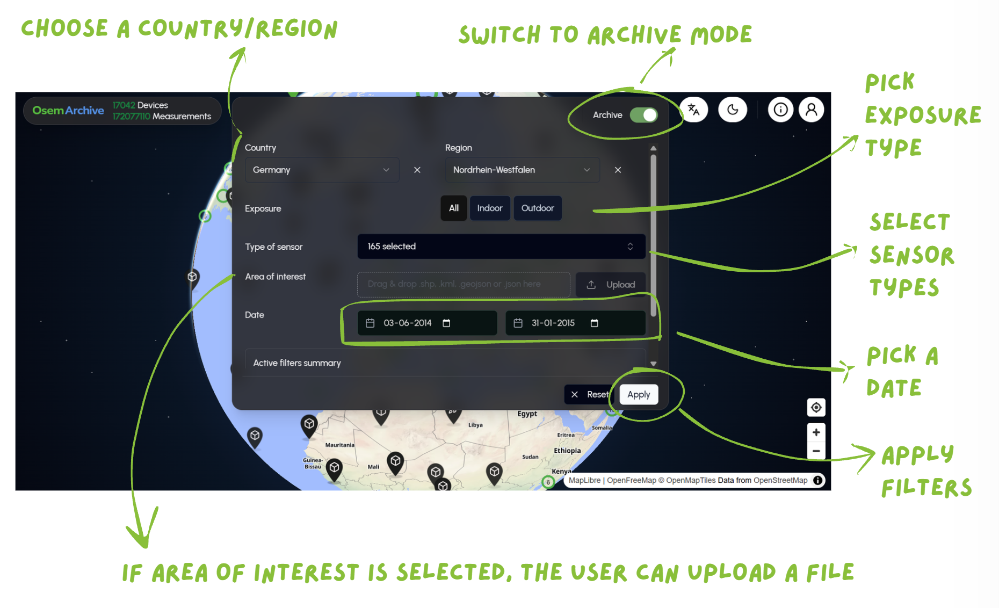
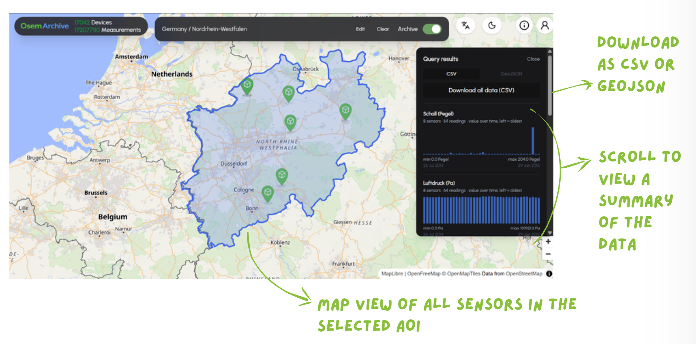

# openSenseMap Archive Redesign

**Developers:** [**Nimesh Akalanka**](https://github.com/nimesh7814), [**Esther Fernandes**](https://github.com/esfern), and [**Hridayashree Burla**](https://github.com/hridaya-dev)

This repository redesigns the folder-based historical archive published at [archive.opensensemap.org](https://archive.opensensemap.org/). It turns daily JSON and CSV files into a queryable archive service and integrates historical-data exploration into the openSenseMap interface.[^study-project]

## Project Goal

The regular openSenseMap service is optimized for recent and live station data and retains measurements for the most recent five years. Older measurements remain available in the historical archive, but its original folder-based structure makes them difficult to explore.

### Previous Archive Experience

Before this redesign, the archive was presented as thousands of folders—one folder for each day. A user had to choose a date first and then manually inspect station metadata and individual sensor CSV files. Finding the same phenomenon across several dates or locations required repeating this process, and there was no direct filtering by region, time range, sensor type, or area of interest.

<p align="center">
  
</p>

<p align="center"><em>The previous archive interface organized historical data by date folders rather than searchable criteria.</em></p>

### Redesigned Experience

This project provides one user experience for both data sources:

- **Live mode** uses the regular openSenseMap API for recent station data.
- **Archive mode** uses a separate archive API and database for the complete imported history.
- A switch in the map interface lets users move between the two modes without leaving openSenseMap.

Keeping the archive database separate has operational advantages. Historical measurements are mostly read-only, with new data imported from the daily archive dump. TimescaleDB can therefore compress older chunks and maintain hourly, daily, monthly, and yearly aggregates without affecting the write-heavy live database.

## How It Works

The archive pipeline turns the daily files published by openSenseMap into data that can be searched, visualized, and exported from the map interface:

```text
Daily JSON and CSV files on archive.opensensemap.org
                         |
                         v
              Archive importer and scheduler
              - imports station and sensor data
              - records progress for safe restarts
                         |
                         v
                PostgreSQL + TimescaleDB
                - stores the full archive
                - compresses older raw data
                - maintains time-based aggregates
                         |
                         v
                   FastAPI archive API
                - filters by place, date, and sensor
                - supports area-of-interest queries
                - starts CSV and GeoJSON exports
                         |
                         v
                  openSenseMap interface
                  Live mode <-> Archive mode
```

The importer processes station metadata and sensor measurements one day at a time. It saves its progress in PostgreSQL, so an interrupted import can continue from the last completed day instead of starting again.

When a user switches to **Archive mode**, the frontend sends filter and area-of-interest queries to the archive API. **Live mode** continues to use the regular openSenseMap API for recent data.

Redis caches frequently requested API results and queues background export jobs. Celery generates large CSV and GeoJSON files without blocking the API, and MinIO stores those files temporarily until they are downloaded or expire.

## What the New Interface Looks Like

In Archive mode, users can choose a country and region, filter by exposure and sensor type, select a date range, or upload a custom area-of-interest file.



The results view highlights the selected area and its sensors on the map. A summary panel shows the available measurements and lets users export the result as CSV or GeoJSON.



## Repository Layout

| Path                     | Purpose                                                  |
| ------------------------ | -------------------------------------------------------- |
| `backend/api/`           | FastAPI archive query and export API                     |
| `backend/ingest/`        | Historical importer and daily scheduler                  |
| `backend/db/migrations/` | TimescaleDB schema, compression, aggregates, and indexes |
| `frontend/`              | React Router openSenseMap interface with archive mode    |
| `Concept/`               | Early project concept and supporting design notes        |
| `materials/`             | Architecture and presentation source material            |
| `img/`                   | Images used by this README                                |
| `docker-compose.yml`     | Complete local infrastructure and application stack      |

## Run the Project Locally

### Requirements

- Docker Desktop or Docker Engine with Docker Compose v2
- Git
- Enough local disk space for the archive data you choose to import

### 1. Clone the repository

```powershell
git clone https://github.com/nimesh7814/OSem-Archive.git
cd OSem-Archive
```

### 2. Create the environment files

From the repository root, copy the provided local-development settings.

PowerShell:

```powershell
Copy-Item backend/.env.example backend/.env
Copy-Item frontend/.env.example frontend/.env
```

macOS or Linux:

```bash
cp backend/.env.example backend/.env
cp frontend/.env.example frontend/.env
```

The example values work for a local trial. Change the placeholder passwords and secrets before exposing the application to a network or using it outside a disposable development environment.

### 3. Build and start the application

One command starts the frontend, API, database, cache, object storage, export worker, and daily scheduler:

```powershell
docker compose --env-file backend/.env up -d --build
```

The initial build downloads the container images and application dependencies, so it takes longer than later starts. When it finishes, open:

- Frontend: http://localhost:3010
- Archive API documentation: http://localhost:8001/docs
- Archive API health: http://localhost:8001/health

The manual historical importer and pgAdmin are profile-based services and are not started by this command.

### 4. Verify the stack

```powershell
docker compose --env-file backend/.env ps -a
curl http://localhost:8001/health
```

A healthy API response has `status: "ok"` and reports `ok` for the database, Redis, MinIO, and Celery worker. The `minio-init` container should show `Exited (0)` after creating the export bucket; this is expected.

To stop the application without deleting its data:

```powershell
docker compose --env-file backend/.env down
```

## Import Archive Data

The database starts empty. To import all available historical data, run:

```powershell
docker compose --env-file backend/.env run --rm ingest
```

The first import can take a long time because it begins at the earliest date available on `archive.opensensemap.org`. It is safe to stop and rerun: completed station/day work and the last completed day are recorded in the `ingest_log` table.

The `ingest-scheduler` checks for new archive folders each day. See [Archive ingestion](backend/README.md#archive-ingestion) for the import process, schedule configuration, and recovery behavior.

To start the optional pgAdmin interface at http://localhost:5151:

```powershell
docker compose --env-file backend/.env --profile admin up -d pgadmin
```

## Common Commands

```powershell
# Show all service states, including completed one-shot containers
docker compose --env-file backend/.env ps -a

# Follow application logs
docker compose --env-file backend/.env logs -f api osem_frontend

# Follow import progress
docker compose --env-file backend/.env logs -f ingest ingest-scheduler

# Rebuild after source changes
docker compose --env-file backend/.env up -d --build api celery-worker osem_frontend

# Stop containers while preserving data volumes
docker compose --env-file backend/.env down
```

Do not run `docker compose down -v` unless you intentionally want to delete the imported archive database, Redis data, MinIO exports, and other named volumes.

## Troubleshooting

- Confirm Docker is running with `docker info`.
- Check container state with `docker compose --env-file backend/.env ps -a`.
- Inspect application logs with `docker compose --env-file backend/.env logs --tail 200 api osem_frontend`.
- If a documented port is already in use, stop the conflicting local service or change the corresponding port mapping in `docker-compose.yml`.

## Development Documentation

- [Backend architecture, ingestion, API, and local development](backend/README.md)
- [Frontend environment, local development, and project structure](frontend/README.md)

## Design Outcome

This design achieves the project goal by replacing manual navigation through dated archive folders with one searchable interface for both recent and historical sensor data. Users can switch between Live and Archive modes, filter historical measurements by location, time, phenomenon, exposure, or a custom area of interest, inspect the results on the map, and export larger datasets as CSV or GeoJSON. The separate archive database and background-processing services provide these capabilities without adding historical-query or export workloads to the live openSenseMap database.

[^study-project]: This is a study project for the [University of Münster](https://www.uni-muenster.de/en/), Summer Semester 2026, at the [Institute for Geoinformatics](https://www.uni-muenster.de/Geoinformatics/en/).
