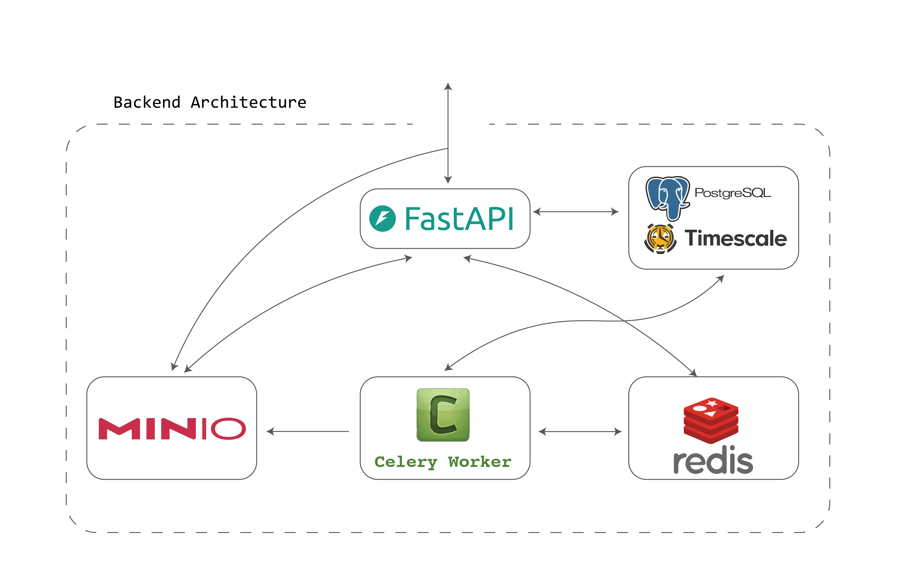

# OSeM Archive Backend

The backend imports, stores, queries, and exports historical openSenseMap measurements. For the project overview and complete Docker stack, start with the [root README](../README.md).

## Backend Architecture

<p align="center">
  
</p>

<p align="center"><em>Archive backend components and the data flow between FastAPI, TimescaleDB, Redis, Celery, and MinIO.</em></p>

| Component | Technology | Responsibility |
| --- | --- | --- |
| Archive API | FastAPI | Validates requests and serves archive metadata, measurements, and export endpoints |
| Archive database | PostgreSQL + TimescaleDB | Stores station and sensor history, compresses older measurements, and maintains time-based aggregates |
| Import services | Python importer and scheduler | Reads daily archive files, assigns geographic regions, and records resumable progress |
| Cache and job broker | Redis | Caches common API results and carries Celery export jobs |
| Export worker | Celery | Runs large queries and generates CSV or GeoJSON files outside the API request cycle |
| Export storage | MinIO | Temporarily stores generated files and provides signed download URLs |

The archive database is separate from the live openSenseMap database. This keeps expensive historical queries, compression, aggregation, and exports away from the write-heavy live service.

## Backend Structure

| Path                          | Purpose                                      |
| ----------------------------- | -------------------------------------------- |
| `api/main.py`                 | FastAPI application entrypoint               |
| `api/app/app.py`              | Routes and dependency health checks          |
| `api/app/measurements.py`     | Region and AOI measurement queries           |
| `api/app/tasks.py`            | Celery export tasks                          |
| `api/app/bucket.py`           | MinIO storage and download URLs              |
| `ingest/load_archive.py`      | Resumable folder archive importer            |
| `ingest/scheduler.py`         | Daily importer scheduler                     |
| `db/migrations/`              | Schema, compression, aggregates, and indexes |
| `data/admin_boundary.geojson` | Country and region boundary seed data        |

## Run Only the Backend With Docker

Follow the root [environment setup](../README.md#2-create-the-environment-files) first. Then run this command from the repository root to start the backend services without the frontend or full historical import:

```powershell
docker compose --env-file backend/.env up -d --build `
  timescaledb redis minio minio-init api celery-worker ingest-scheduler
```

This starts the API, database, cache, object storage, export worker, and daily scheduler. It does not run the potentially long initial historical import.

Check the API and its dependencies:

```powershell
Invoke-RestMethod http://localhost:8001/health
```

The response should report `status: "ok"` for the application and each dependency:

```text
database      ok
redis         ok
minio         ok
celeryWorker  ok
```

Development endpoints:

- API root: http://localhost:8001
- Dependency health: http://localhost:8001/health
- OpenAPI documentation: http://localhost:8001/docs

## Archive Ingestion

### Initial Historical Import

Run the one-shot importer explicitly:

```powershell
docker compose --env-file backend/.env run --rm ingest
```

On an empty database, it discovers the earliest and latest date folders on `archive.opensensemap.org` and imports them in chronological order. For every station/day it:

1. Reads the station JSON metadata.
2. Upserts the station and its sensors.
3. Assigns the station to a geographic region.
4. Replaces that sensor/day's measurements with the archived CSV contents.
5. Records completion and row counts in `ingest_log`.

The importer commits progress continuously. If interrupted, the next run resumes after the last completed day and skips station/day combinations already marked as done.

### Daily Scheduled Import

The scheduler runs the same importer at the configured time:

```env
INGEST_SCHEDULE_TIME=00:00
INGEST_SCHEDULE_TIMEZONE=Europe/Berlin
INGEST_SCHEDULER_RUN_ON_START=false
```

Set `INGEST_SCHEDULER_RUN_ON_START=true` only if the scheduler should also import immediately whenever its container starts. Otherwise, it waits for the configured daily time. Use the root README's [common commands](../README.md#common-commands) to follow import logs.

## Storage Design

`measurements` is a TimescaleDB hypertable split into seven-day chunks. Chunks older than seven days are compressed, segmented by `sensor_id`, and ordered by descending timestamp. This fits the archive workload because older measurements are read frequently but changed only when an archive day is re-imported.

Continuous aggregates provide progressively coarser query tiers:

| View              | Source            | Intended use                            |
| ----------------- | ----------------- | --------------------------------------- |
| `reading_hourly`  | Raw measurements  | Short-range detailed analysis           |
| `reading_daily`   | Hourly aggregate  | Multi-month and default archive queries |
| `reading_monthly` | Daily aggregate   | Long-range trends                       |
| `reading_yearly`  | Monthly aggregate | Whole-history overview                  |

Important tables:

| Table          | Purpose                                           |
| -------------- | ------------------------------------------------- |
| `measurements` | Raw archived sensor readings                      |
| `boxes`        | Station metadata and location                     |
| `sensors`      | Sensor metadata and latest archived value         |
| `regions`      | Country and administrative-region polygons        |
| `summary`      | Archive-wide counts                               |
| `ingest_log`   | Resumable import checkpoint and per-day status    |
| `export_job`   | Export metadata retained for schema compatibility |

Schema files under `db/migrations/` are applied automatically only when the TimescaleDB volume is first created. Do not delete the volume merely to reapply a migration when it contains imported archive data.

## API Overview

| Endpoint                                       | Purpose                                   |
| ---------------------------------------------- | ----------------------------------------- |
| `GET /health`                                  | Database, Redis, MinIO, and worker health |
| `GET /stats`                                   | Archive-wide counts                       |
| `GET /boxes`                                   | Archived station metadata                 |
| `GET /countries`                               | Available countries and regions           |
| `GET /tags`                                    | Available sensor types                    |
| `GET /phenomena`                               | Available measured phenomena              |
| `GET /exposure`                                | Available exposure values                 |
| `GET /regions/{country}/{region}/measurements` | Region query                              |
| `POST /aoi/validate`                           | Validate an uploaded AOI file             |
| `POST /aoi/measurements`                       | AOI measurement query                     |
| `POST .../exports`                             | Queue a CSV or GeoJSON export             |
| `GET /exports/{job_id}`                        | Poll export status                        |
| `GET /exports/{job_id}/download`               | Download a completed export               |

## Asynchronous Export Flow

Exports use the following pipeline:

```text
FastAPI -> Redis queue -> Celery worker -> MinIO -> signed download URL
```

The API rejects new export work if a required dependency is unavailable. Check `/health` first when diagnosing export failures.

## Run the API Locally

Docker is recommended for the supporting services:

```powershell
docker compose --env-file backend/.env up -d timescaledb redis minio minio-init
```

For host-based Python development, copy `.env.example` to `.env`, replace its placeholder secrets, and use host addresses for the supporting services:

```env
POSTGRES_HOST=localhost
POSTGRES_PORT=5433
REDIS_HOST=localhost
MINIO_ENDPOINT=localhost:9000
CELERY_BROKER_URL=redis://localhost:6379/0
CELERY_RESULT_BACKEND=redis://localhost:6379/1
```

Then install and run:

```powershell
cd backend
python -m venv .venv
.\.venv\Scripts\Activate.ps1
pip install -r requirements.txt
uvicorn api.main:app --reload --host 0.0.0.0 --port 8000
```

Run the backend tests with:

```powershell
python -m unittest api.tests.test_backend_api
```

## Database Access

```powershell
docker exec -it timescaledb psql -U <POSTGRES_USER> -d <POSTGRES_DB>
```

Use the values from `backend/.env` in place of the placeholders.
